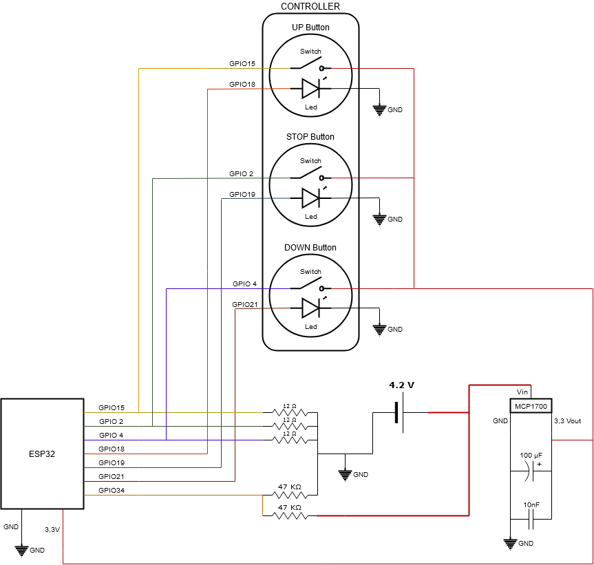

# esp32-blinds-control

This project is useful for controlling the blind. Related to another [jarolift domotic project](https://github.com/oyola0/jarolift-domotic)

#### Required

* 1 ESP32
* 1 [ESP32 adaptor board](https://www.aliexpress.com/item/32811323132.html?spm=a2g0s.9042311.0.0.42824c4dZQ09Lq)
* 1 MCP1700
* 1 Capacitor 100µF
* 1 Capacitor 10nF
* 3 Resistance 12 ohms
* 2 Resistance 47k
* 2 [White LED Light Momentary 3V](https://es.aliexpress.com/item/32812948786.html?spm=a2g0s.9042311.0.0.37cd63c0dXF9Tt)
* 1 [Red LED Light Momentary 3V](https://www.aliexpress.com/item/32812948786.html?spm=a2g0s.9042311.0.0.37cd63c0dXF9Tt)
* 1 [3 x AA Power Battery Case Box](https://www.aliexpress.com/item/4000931485961.html?spm=a2g0o.productlist.0.0.7bdd1bf9TmRz4M&s=p&ad_pvid=202009251045517112643326926650001396654_1&algo_pvid=7fb23bb9-e7e4-4cd8-8b5b-72cb9f428f72&algo_expid=7fb23bb9-e7e4-4cd8-8b5b-72cb9f428f72-0&btsid=0b0a0ae216010559513543439e25ed&ws_ab_test=searchweb0_0,searchweb201602_,searchweb201603_)

## How does it work? 
From deep sleep mode, wakes up when any button is pressed

1. Connecting WIFI (blinking all the LEDs until the wifi is connected)
2. Checking battery level
3. Execute the button pressed command (up, stop, down)
4. It will wait for another button to be pressed for 20 seconds
5. Checking OTA updates (blinking stop button during the process)
6. Return to sleep mode (fadeout of all buttons)

## Circuit diagram

   

